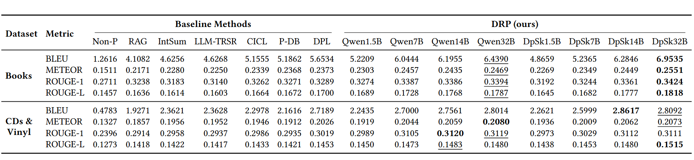

<div align=center>

<h1>Unveiling Inference Scaling for Difference-Aware User Modeling in LLM Personalization</h1>

[](https://huggingface.co/datasets/SnowCharmQ/DPL-main)
[](https://huggingface.co/datasets/SnowCharmQ/DPL-meta)
[](https://huggingface.co/datasets/SnowCharmQ/DPL-Yelp)
[](LICENSE)

</div>

<br/>

This repository contains the implementation of the Difference-aware Reasoning Personalization (DRP), a framework that reconstructs the difference extraction mechanism by leveraging inference scaling to enhance LLM personalization.

<p id="Catalogue"></p>  

## 📋 Catalogue 

- [📋 Catalogue](#-catalogue)
- [⚙️ Environment Setup](#️-environment-setup)
- [📊 Dataset](#-dataset)
- [⌛️ Quick Start](#️-quick-start)
- [📈 Experimental Results](#-experimental-results)
- [📄 License](#-license)
- [🙏 Acknowledgments](#-acknowledgments)

## ⚙️ Environment Setup

```bash
conda create -n DRP python=3.11
conda activate DRP
pip install -r requirements.txt
```

## 📊 Dataset

This project uses datasets adapted from the [DPL-main dataset](https://huggingface.co/datasets/SnowCharmQ/DPL-main) on Hugging Face:

- **Books**: Book reviews and ratings dataset
- **CDs & Vinyl**: Music album reviews and ratings dataset

You can also process the dataset yourself and store it locally by the following commands:

```bash
cd data/
./create.sh
```

## ⌛️ Quick Start

To execute the DRP method, please first complete the required information in the `.env` file. Then, run the following command:

```bash
./main.sh
```

You can modify the `main.sh` file to change parameters.

## 📈 Experimental Results

### Performance Comparison



Results on both datasets. **QwenX** and **DpSkX** refer to the Qwen-Instruct and DeepSeek-R1-Distill-Qwen models, respectively, each with X parameters. The best and second-best results are highlighted in **bold** and <u>underlined</u> font, respectively.

### Key Findings

- Our DRP method achieves competitive performance across different model sizes
- DeepSeek models show strong performance on the Books dataset
- Qwen models demonstrate excellent results on CDs & Vinyl dataset

## 📄 License

This project is licensed under the MIT License - see the [LICENSE](LICENSE) file for details.

## 🙏 Acknowledgments

We thank the developers of the baseline methods and datasets used in this project. Special thanks to the [DPL project](https://huggingface.co/datasets/SnowCharmQ/DPL-main) for providing the dataset.

---

<div align=center>

**Note**: This is a research project. For questions or issues, please open an issue in this repository.

*Last updated: 2025-11-04*

</div>
